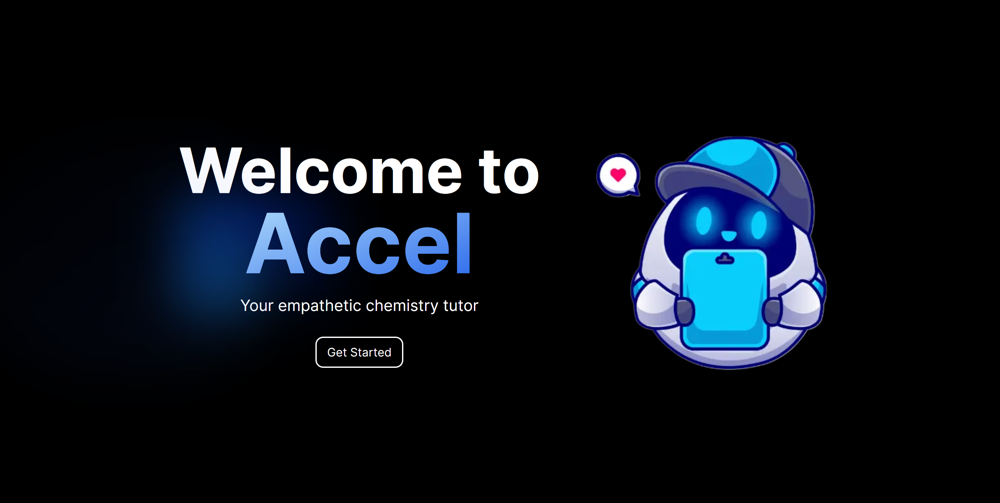

<!-- PROJECT LOGO -->
 

    

  <h1 align="center">Accel</h1>

  

    Your empathetic chemistry tutor
     
    <a href="https://devpost.com/software/accel-63xgdn"><strong>Devpost »</strong></a>
     
     
    <a href="https://www.linkedin.com/in/alexander-talreja">Alex Talreja</a>
    ·
    <a href="https://www.linkedin.com/in/2023cyang/">Cindy Yang</a>
    ·
    <a href="https://www.linkedin.com/in/davidsmazur/">David Mazur</a>
    ·
    <a href="https://www.linkedin.com/in/selina-sun-550301227/">Selina Sun</a>
  

<!-- TABLE OF CONTENTS -->

  
Table of Contents

  <ol>
    <li>
      <a href="#about-the-project">About The Project</a>
      <ul>
        <li><a href="#built-with">Built With</a></li>
      </ul>
    </li>
    <li>
      <a href="#technologies">Technologies</a>
      <ul>
        <li><a href="#intel-ai">Intel AI</a></li>
        <li><a href="#amazon-bedrock">Amazon Bedrock</a></li>
        <li><a href="#hume-evi">Hume EVI</a></li>
      </ul>
    </li>
    <li><a href="#contact">Contact</a></li>
    <li><a href="#acknowledgments">Acknowledgments</a></li>
  </ol>

<!-- ABOUT THE PROJECT -->
## About The Project

Traditional study methods and automated tutoring systems often focus solely on providing answers. This approach neglects the emotional and cognitive processes that are crucial for effective learning. Students are left feeling overwhelmed, anxious, and disconnected from the material.

Accel is designed to address these challenges by offering a unique blend of advanced AI technology and emotional intelligence. Here's how Accel transforms the study experience: 

* **Concept Breakdown**: Accel deconstructs complex chemistry topics into easy-to-understand segments, ensuring that students grasp foundational concepts thoroughly.
* **Emotional Intelligence**: Using cutting-edge vocal emotion recognition technology, Accel detects frustration, confusion, or boredom, tailoring its responses to match the student’s emotional state, offering encouragement and hints instead of immediate answers.
* **Adaptive Learning**: With Quiz Mode, students receive feedback on their progress, highlighting their strengths and areas for improvement, fostering a sense of accomplishment.

### Built With

[![Next][Next.js]][Next-url]
[![React][React.js]][React-url]
[![Tailwind][Tailwind]][Tailwind-url]
[![Flask][Flask]][Flask-url] 
[![Amazon][Amazon]][Amazon-url]
[![LangChain][LangChain]][langchain-url]
[![Intel][Intel]][Intel-url]
[![Hume][Hume]][Hume-url]

(<a href="#readme-top">back to top</a>)

<!-- GETTING STARTED -->
## Technologies

Technical jargon time 🙂‍↕️

### Intel AI

To build the core capabilities of Accel, we used both Intel Gaudi and the Intel AI PC. Intel Gaudi allowed us to distill a model ("selinas/Accel3") by fine-tuning with synthetic data we generated from a 70B model ("liminerity/Phigments12") to 3B, allowing us to successfully run our app on the Intel AI PC. The prospect of distributing AI apps with local compute to deliver a cleaner and more secure user experience was very exciting, and we also enjoyed thinking about the distributed systems implications of NPUs.

### Amazon Bedrock

To further enhance the capabilities of Accel, we utilized Amazon Bedrock to integrate Retrieval-Augmented Generation (RAG) and AI agents. This integration allows the chatbot to provide more accurate, contextually relevant, and detailed responses, ensuring a comprehensive learning experience for students.

When a student asks a question, the RAG mechanism first retrieves relevant information from a vast database of chemistry resources. It then uses this retrieved information to generate detailed and accurate responses. This ensures that the answers are not only contextually relevant but also backed by reliable sources.

Additionally, we utilized agents to service the chat and quiz features of Accel. Accel dynamically routes queries to the appropriate agent, which work in coordination to deliver a seamless and multi-faceted tutoring experience. When a student queries, the relevant agent is activated to provide a specialized response.

### Hume EVI

The goal of Accel is to not only provides accurate academic support but also understands and responds to the emotional states of students, fostering a more supportive and effective learning environment. 

Hume's EVI model was utilized for real-time speech to text (and emotion) conversion. The model begins listening when the user clicks the microphone input button, updating the input bar with what the model has heard so far. When the user turns their microphone off, this text is automatically sent as a message to Accel, along with the top 5 emotions picked up by EVI. Accel uses these cues to generate an appropriate response using our fine-tuned LLM.

Additionally, the users' current mood gauge is displayed on the frontend for a deeper awareness of their own study tendencies.

(<a href="#readme-top">back to top</a>)

<!-- CONTACT -->
## Contact
Alex Talreja (amazon bedrock, agents) - vta3nc@virginia.edu

Cindy Yang (frontend, systems integration) - cwyang@umich.edu

David Mazur (TODO) - dsmazur@umich.edu

Selina Sun (TODO) - selinas@umich.edu

<!-- MARKDOWN LINKS & IMAGES -->
<!-- https://www.markdownguide.org/basic-syntax/#reference-style-links -->
[product-screenshot]: images/screenshot.png
[Next.js]: https://img.shields.io/badge/next.js-000000?style=for-the-badge&logo=nextdotjs&logoColor=white
[Next-url]: https://nextjs.org/
[React.js]: https://img.shields.io/badge/React.js-20232A?style=for-the-badge&logo=react&logoColor=61DAFB
[React-url]: https://reactjs.org/
[Tailwind]: https://img.shields.io/badge/Tailwind-35495E?style=for-the-badge&logo=tailwindcss&logoColor=06B6D4
[Tailwind-url]: https://tailwindcss.com/
[Flask]: https://img.shields.io/badge/Flask-FF2D20?style=for-the-badge&logo=flask&logoColor=white
[Flask-url]: https://flask.palletsprojects.com/en/3.0.x/
[Intel]: https://img.shields.io/badge/Intel_ai-0769AD?style=for-the-badge&logo=intel&logoColor=white
[Intel-url]: https://www.intel.com/content/www/us/en/developer/topic-technology/artificial-intelligence/overview.html
[Hume]: https://img.shields.io/badge/Hume_EVI-563D7C?style=for-the-badge&logo=polkadot&logoColor=white
[Hume-url]: https://beta.hume.ai/
[LangChain]: https://img.shields.io/badge/LangChain-DD0031?style=for-the-badge&logo=langchain&logoColor=white
[LangChain-url]: https://www.langchain.com/
[Amazon]: https://img.shields.io/badge/Amazon_Bedrock-4A4A55?style=for-the-badge&logo=amazonwebservices&logoColor=FF3E00
[Amazon-url]: https://aws.amazon.com/bedrock/?gclid=CjwKCAjw7NmzBhBLEiwAxrHQ-R43KC_xeXdqadUZrt7upH8LYrZMbCOi-j7Hn7RHxfyKg1tJdlt2FBoCr_IQAvD_BwE&trk=0eaabb80-ee46-4e73-94ae-368ffb759b62&sc_channel=ps&ef_id=CjwKCAjw7NmzBhBLEiwAxrHQ-R43KC_xeXdqadUZrt7upH8LYrZMbCOi-j7Hn7RHxfyKg1tJdlt2FBoCr_IQAvD_BwE:G:s&s_kwcid=AL!4422!3!692006004688!p!!g!!amazon%20bedrock!21048268554!159639952935
